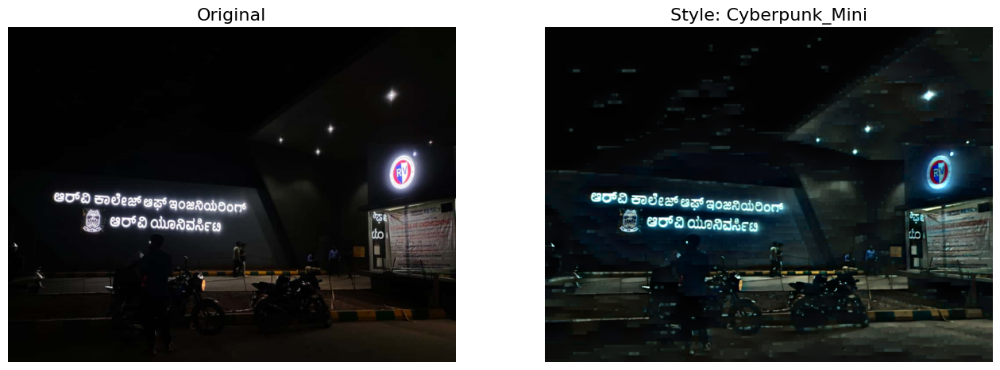
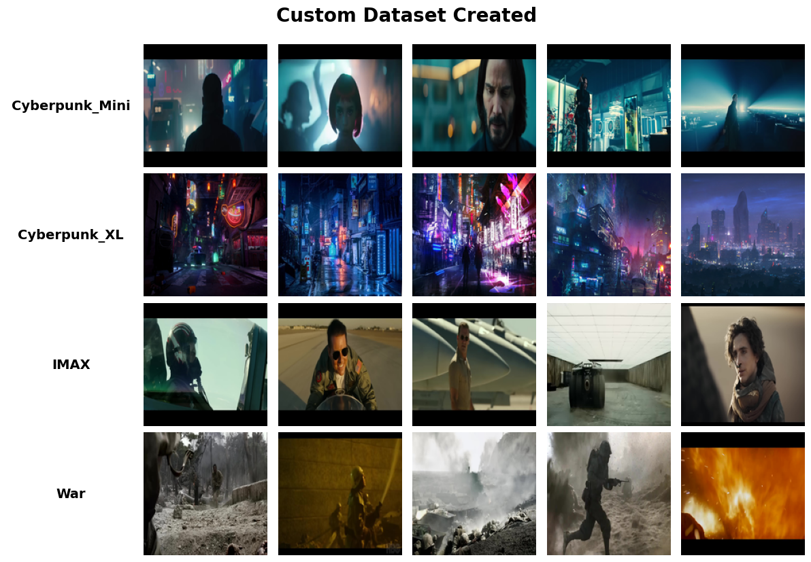

# Neural Style Transfer for Visual Data [[Paper](NSTVD.pdf)]

**Neural Style Transfer for Visual Data** is a lightweight, multi-style transfer system designed to transform visual content into artistically stylized outputs. By separating and recombining image content and style features using Convolutional Neural Networks (CNNs) and CLIP guidance, this project aims to make high-quality style transfer accessible on consumer-grade hardware.

---

## Abstract

Neural style transfer for video is a process that changes visual content into artistically stylized outputs. While current techniques offer great results, they often demand massive datasets and powerful computing resources. This research introduces a small multi-style video style transfer system.

For a comprehensive technical analysis, methodology, and detailed experimental results, please refer to the full paper **NSTVD.pdf** included in this repository.

---

## Key Innovations

- **Consumer-Grade Training**  
  A lightweight dataset made from meticulously selected trailer frames and generic content images allows for effective training on consumer GPUs.

- **Temporal Consistency**  
  Flickering artifacts in video outputs are minimized through optical flow-based feature alignment.

- **Real-Time Application**  
  The trained model can receive inputs and apply selected styles in real-time, making it suitable for streaming overlays and AR effects.

---

## From Synthetic Datasets to Cinematic Post-Processing

Traditionally, Neural Style Transfer (NST) has been heavily utilized in computer vision to generate synthetic datasets. For example, it is often used to bridge the domain gap in autonomous driving by transforming daylight driving footage into night or rainy conditions, thereby augmenting training data without expensive real-world collection.

This project expands the scope of NST beyond data augmentation, repositioning it as a robust post-processing tool for visual effects (VFX) and creative media.

Just as traditional color grading manipulates hue and saturation to achieve a specific mood in cinema, this system applies complex, texture-aware stylization to mimic the visual identity of specific genres. By training on curated frames from movies such as Cyberpunk, War, and IMAX, the model acts as an automated cinematic grading engine.

Creators can take raw footage or ordinary photography and instantly imbue it with the grit of a war drama or the neon-soaked aesthetic of a sci-fi thriller, effectively democratizing high-end visual stylization.

---

## Methodology

The system is built upon a combination of established and novel techniques.

### Backbone

- TransformerNet architecture with encoder, residual, and decoder blocks.

### Loss Functions

- **Content Loss**  
  Computed using high-level features from a pre-trained VGG16 network to preserve image structure.

- **Style Loss**  
  Computed via Gram matrices of VGG features to capture artistic textures.

- **CLIP Loss**  
  A semantic loss derived from OpenAI’s CLIP model to align outputs with textual style descriptions.

---

## Installation

Ensure Python 3.8 or higher is installed. Install dependencies using pip:

    pip install torch torchvision clip-by-openai ftfy regex tqdm pillow

Note: A CUDA-capable GPU is recommended for faster training and inference, though CPU execution is supported.

---

## Usage

### 1. Inference (Applying Styles)

Use the **Inference.ipynb** notebook.

1. Open Inference.ipynb in Jupyter Notebook or Google Colab.
2. Run setup cells to load model classes such as TransformerNet and ConvLayer.
3. Use the interface to:
   - Upload an image
   - Select a style (Cyberpunk_XL, War, IMAX)
   - Run inference to generate the stylized output

---

### Example Result

---

### 2. Training (Creating New Styles)

Use the **Training.ipynb** notebook.

1. Prepare data by placing content images and style images inside the Dataset directory.
2. Configure text prompts for CLIP guidance:

    PROMPT_MAP = {
        "cyberpunk_xl": "A cinematic photo in the cyberpunk style, masterpiece...",
        "war": "cinematic film still from a war drama..."
    }

3. Run the notebook. The pipeline will:
   - Extract features using VGG16
   - Compute CLIP-based semantic loss
   - Save trained .pth models to the Trained_Models directory

---

### Custom Dataset from Movie Trailers

---

## License

This project is licensed under the MIT License.  
See the LICENSE file for details.
